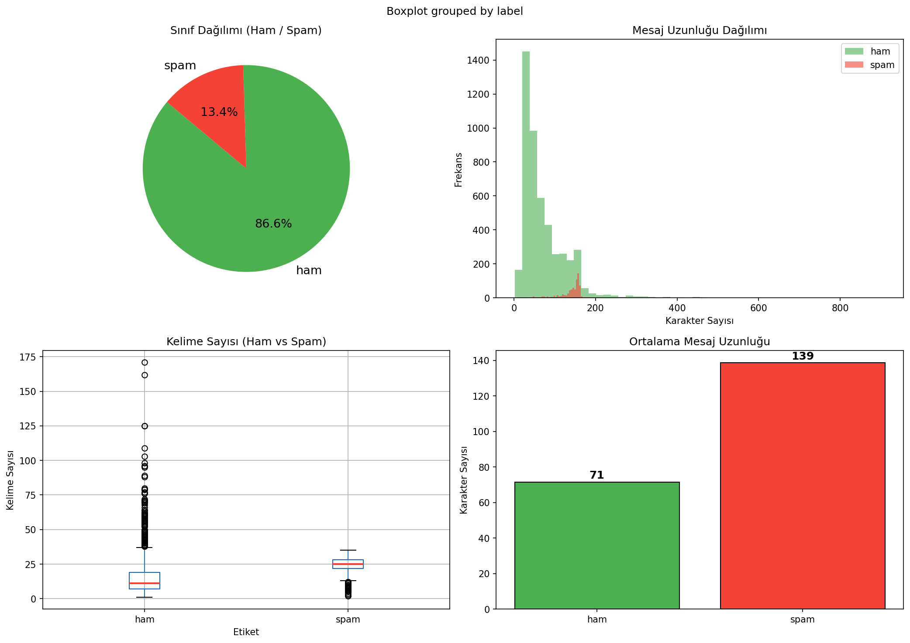
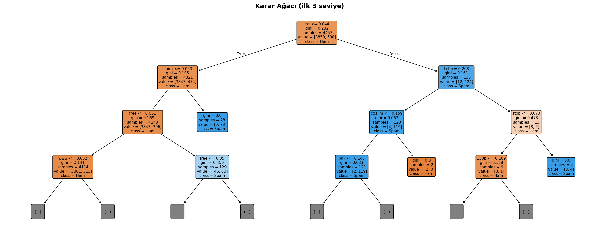
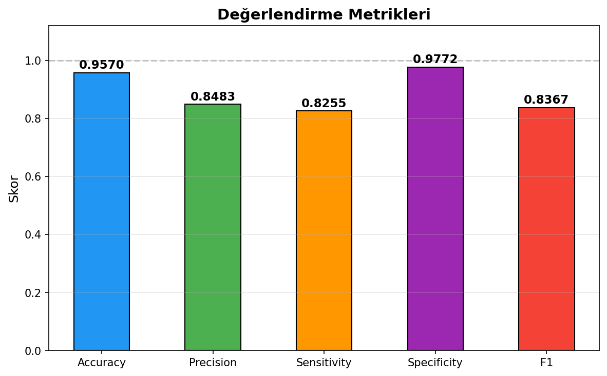
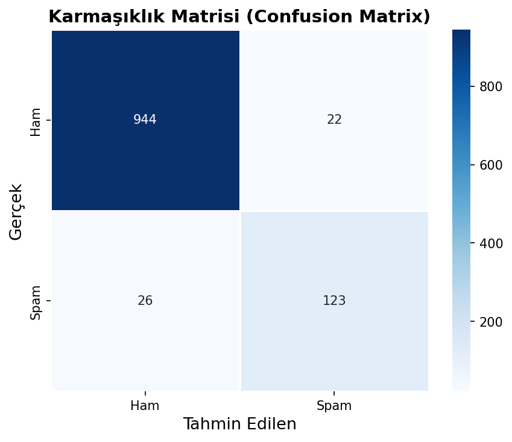
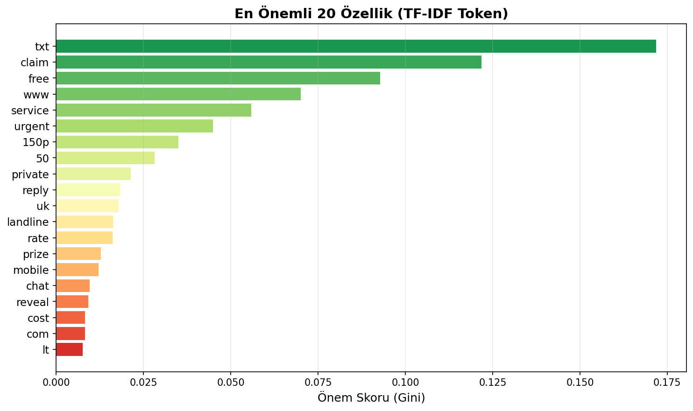
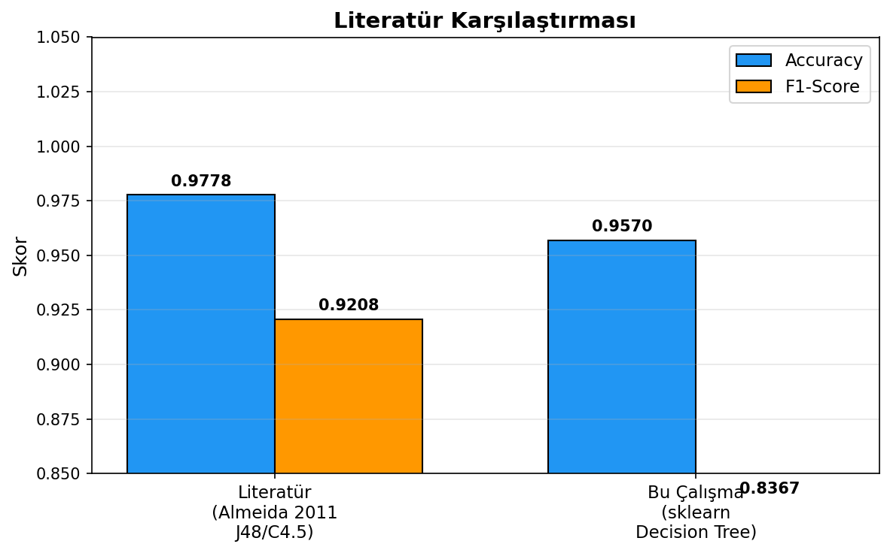

# 📱 SMS Spam Tespiti — Karar Ağacı Sınıflandırması

> **BLM0463 Veri Madenciliğine Giriş | Dönem Projesi**  
> Veri Seti: SMS Spam Collection v.1 · Yöntem: Decision Tree (CART)

---

## 📋 İçindekiler

- [Proje Hakkında](#proje-hakkında)
- [Veri Seti](#veri-seti)
- [Kullanılan Yöntem](#kullanılan-yöntem)
- [Kurulum](#kurulum)
- [Kullanım](#kullanım)
- [Sonuçlar](#sonuçlar)
- [Görselleştirmeler](#görselleştirmeler)
- [Literatür Karşılaştırması](#literatür-karşılaştırması)
- [Proje Yapısı](#proje-yapısı)

---

## Proje Hakkında

Bu proje, kısa mesajların (SMS) spam ya da meşru (ham) olup olmadığını otomatik olarak sınıflandırmak amacıyla **Karar Ağacı (Decision Tree)** algoritmasını uygulamaktadır. Metin verileri TF-IDF yöntemiyle sayısal vektörlere dönüştürülmüş, model GridSearchCV ile optimize edilmiş ve çeşitli metriklerle değerlendirilmiştir.

---

## Veri Seti

| Özellik | Değer |
|---|---|
| Kaynak | [UCI Machine Learning Repository](https://archive.ics.uci.edu/ml/datasets/SMS+Spam+Collection) |
| Toplam Mesaj | 5.572 |
| Ham (Meşru) | 4.825 (%86.6) |
| Spam | 747 (%13.4) |
| Özellik Sayısı | 5.000 (TF-IDF token) |

### Sınıf Dağılımı



Spam mesajların ortalama uzunluğu **139 karakter** iken ham mesajlar ortalama **71 karakter**'de kalmaktadır. Bu belirgin fark, mesaj uzunluğunun sınıflandırmada önemli bir ipucu olduğuna işaret etmektedir.

---

## Kullanılan Yöntem

### Özellik Çıkarımı: TF-IDF

- Unigram + Bigram kombinasyonu
- 5.000 maksimum özellik
- İngilizce stop-word eleme
- Sublinear TF ağırlıklandırma

### Model: CART Karar Ağacı

Scikit-learn `DecisionTreeClassifier` kullanılmıştır. Hiperparametre optimizasyonu için **5-katlı GridSearchCV** uygulanmıştır.

**Aranan parametre uzayı:**

| Parametre | Değerler |
|---|---|
| `criterion` | gini, entropy |
| `max_depth` | 5, 10, 20, None |
| `min_samples_split` | 2, 5, 10 |
| `min_samples_leaf` | 1, 2, 4 |

### Karar Ağacı Yapısı (İlk 3 Seviye)



Kök düğümde `txt` kelimesinin TF-IDF skoru belirleyici kriter olarak öne çıkmakta, bunu `claim`, `free` ve `www` gibi spam göstergesi ifadeler izlemektedir.

---

## Kurulum

```bash
# Gerekli kütüphaneleri yükle
pip install pandas numpy scikit-learn matplotlib seaborn

# Depoyu klonla
git clone https://github.com/KULLANICI_ADI/sms-spam-detection.git
cd sms-spam-detection
```

> `SMSSpamCollection` dosyasının proje kök dizininde bulunması gerekmektedir.

---

## Kullanım

```bash
python sms_spam_decision_tree.py
```

Script çalıştırıldığında sırasıyla şunlar gerçekleşir:

1. Veri yükleme ve EDA grafikleri üretimi
2. TF-IDF özellik çıkarımı
3. GridSearchCV ile hiperparametre optimizasyonu
4. Model eğitimi ve değerlendirme
5. Tüm görsel çıktıların PNG olarak kaydedilmesi
6. Canlı tahmin demosu

---

## Sonuçlar

### Değerlendirme Metrikleri



| Metrik | Skor |
|---|---|
| **Accuracy** | **0.9570** |
| Precision | 0.8483 |
| Sensitivity (Recall) | 0.8255 |
| Specificity | 0.9772 |
| F1-Score | 0.8367 |

### Karmaşıklık Matrisi



| | Tahmin: Ham | Tahmin: Spam |
|---|---|---|
| **Gerçek: Ham** | 944 (TN) | 22 (FP) |
| **Gerçek: Spam** | 26 (FN) | 123 (TP) |

Test setindeki 1.115 mesajdan **1.067'si doğru sınıflandırılmıştır**.

---

## Görselleştirmeler

### En Önemli 20 Özellik (TF-IDF Token)



`txt`, `claim` ve `free` kelimeleri Gini safsızlığını en çok düşüren özellikler olarak öne çıkmaktadır.

---

## Literatür Karşılaştırması



| | Accuracy | F1-Score |
|---|---|---|
| **Almeida vd. 2011 (J48/C4.5)** | 0.9778 | 0.9208 |
| **Bu Çalışma (sklearn CART)** | 0.9570 | 0.8367 |

> **Referans:** Almeida T.A., Gómez Hidalgo J.M., Yamakami A. (2011). *Contributions to the Study of SMS Spam Filtering*, ACM DocEng'11.

Performans farkının temel nedeni: C4.5 algoritması daha gelişmiş **budama mekanizmaları** ve **ayrık özellik desteği** içermektedir. Scikit-learn'ün CART implementasyonu ise sürekli değerleri bölme stratejisi kullanır.

---

## Proje Yapısı

```
sms-spam-detection/
│
├── sms_spam_decision_tree.py   # Ana kaynak kodu
├── SMSSpamCollection           # Veri seti (tab-ayrımlı)
├── README.md
│
└── Resimler/
    ├── eda_plots.png           # Keşifsel veri analizi
    ├── confusion_matrix.png    # Karmaşıklık matrisi
    ├── metrics_bar.png         # Değerlendirme metrikleri
    ├── feature_importance.png  # Özellik önem sıralaması
    ├── decision_tree_visual.png# Karar ağacı görselleştirmesi
    └── literature_comparison.png # Literatür karşılaştırması
```

---

## Lisans

Bu proje akademik amaçlı üretilmiştir. Veri seti UCI Machine Learning Repository lisans koşullarına tabidir.
